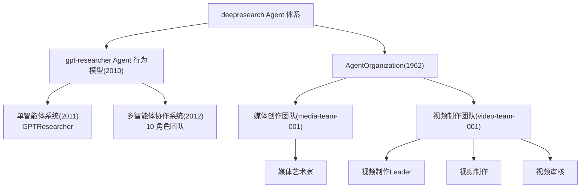

# deepresearch · Agent 组织与协作梳理

> 依据：意图架构图谱 `design/KG/SystemArchitecture.json`
> 范围：全部 Agent（研究智能体 + 媒体/视频生产 Actor）的能力、协作关系、被卷入的主要业务流程
> 配套交付：`actor-explainer.mp4`（讲解视频）

## 一、Agent 全景

deepresearch 的 Agent 体系分两大块：

| 体系 | 子块 | 元素 | 角色数 |
|---|---|---|---|
| gpt-researcher Agent 行为模型 | 单智能体系统 | GPTResearcher | 1 个组件 |
| gpt-researcher Agent 行为模型 | 多智能体协作系统 | ChiefEditor/Editor/Research/Writer/Reviewer/Reviser/FactChecker/Human/Visualizer/Publisher | 10 个组件 |
| AgentOrganization | 媒体创作团队 | 媒体艺术家 | 1 个 Actor |
| AgentOrganization | 视频制作团队 | 视频制作Leader / 视频制作 / 视频审核 | 3 个 Actor |

## 二、研究智能体（gpt-researcher Agent 行为模型）

### 1. 单智能体系统 GPTResearcher（2020，Application Component）
- **能力（行为函数）**：`choose_agent` 选择智能体角色；`plan_research` 规划研究子查询；
  `conduct_research` 按来源执行检索并累积上下文；`curate_sources` 来源可信度策展；
  `write_report` 基于上下文撰写报告；`deep_research` breadth×depth 深度递归下钻。
- **数据对象**：研究上下文、研究来源、报告（Markdown）、子主题。
- **外部依赖**：LLM 提供商。

### 2. 多智能体协作团队（2012，10 个 Application Component）

| 角色 | id | 职责 |
|---|---|---|
| ChiefEditorAgent | 2050 | 构建 LangGraph StateGraph(ResearchState) 并编排研究团队（run_research_task） |
| EditorAgent | 2051 | 规划章节大纲（≥3 章）并并行启动各章节研究（run_parallel_research） |
| ResearchAgent | 2052 | 包装 GPTResearcher，执行初始研究/子主题/章节深度研究（run_initial/depth_research） |
| WriterAgent | 2053 | 撰写章节内容与修订标题 |
| ReviewerAgent | 2054 | 按 guidelines 评审草稿（review_draft） |
| ReviserAgent | 2055 | 按评审意见修订草稿（revise_draft） |
| FactCheckerAgent | 2056 | 核查事实与幻觉 |
| HumanAgent | 2057 | 人工在环评审研究计划（review_plan 条件） |
| VisualizerAgent | 2059 | 生成 Mermaid 图表 |
| PublisherAgent | 2058 | 生成布局并按 pdf/docx/markdown 发布 |

## 三、媒体/视频生产 Actor（AgentOrganization）

| Actor | id | 团队 | 能力 |
|---|---|---|---|
| 媒体艺术家 | media-artist-001 | 媒体创作团队 | 图像生成（qwen-image / dashscope-media-generator）、视觉验收（qwen3-vl-plus）、视频生成（dashscope-video-generator） |
| 视频制作Leader | video-leader-001 | 视频制作团队 | 需求解析、统筹编排（指派制作/指派审核）、交付、负最终责任 |
| 视频制作 | video-producer-001 | 视频制作团队 | 视频生成（HappyHorse / 万相 wan2.7-t2v，异步轮询下载 MP4） |
| 视频审核 | video-reviewer-001 | 视频制作团队 | 抽帧 + qwen3-vl-plus 逐条核对（元素/主题/时长分辨率/标注） |

## 四、协作关系

### 研究智能体协作（多智能体编排）
- **ChiefEditorAgent** `run_research_task` 构建 StateGraph，将 **ResearchState** 作为团队共享状态；
- **EditorAgent** `run_parallel_research` 为各章节并行启动 **research → review → revise** 子工作流（读写 **DraftState**）；
- **ReviewerAgent → ReviserAgent** 构成评审/修订循环（触发边 1240/1241）；**HumanAgent** 在规划后做人工在环条件评审。

### 生产 Actor 协作
- 媒体艺术家 —`Assignment`→ 图片视频生成 Role →`Association(uses)`→ 图像生成 / 视觉验收 / 视频生成 3 项 Skill；
- 视频制作Leader —`Aggregation`→ 视频制作、视频审核；制作/审核分别使用视频生成与视觉验收 Skill（与媒体团队共享）。

## 五、被卷入的主要业务流程

### 流程 A：单智能体研究-报告流程（2047）
`choose_agent` → `plan_research`（生成子主题）→ `conduct_research`（按 report_source 分支）→ `curate_sources` → `write_report`（可选图片预生成；`deep_research` 分支独立下钻）。

### 流程 B：多智能体 LangGraph 工作流（2082）
`browser(initial_research)` → `planner(plan_research)` → `human(review_plan 条件)` → `researcher(run_parallel_research)` → `writer` → `fact_checker(条件)` → `visualizer` → `publisher` → END；
每章走「章节草稿评审修订子工作流（2083）」：`researcher(run_depth_research)` → `reviewer(review_draft)` → `reviser(revise_draft)` 循环直至接受。

### 流程 C：媒体创作流程
需求（主题/风格/用途/数量/尺寸）→ 图像生成（qwen-image / qwen-image-plus）→ 视觉验收迭代（qwen3-vl-plus）→ 输出 PNG 至 `docs/diagrams/`；视频类任务走 dashscope-video-generator 异步产出 MP4。

### 流程 D：视频制作流程
需求提出者 → 视频制作Leader 解析 → 指派视频制作异步生成 → 指派视频审核抽帧核对 → 通过交付 MP4 / 不通过返工重制。

## 六、工具链（Skill）清单

| Skill | id | 用途 |
|---|---|---|
| dashscope-media-generator | media-skill-001 | 图像生成（qwen-image / qwen-image-plus，原生 text2image） |
| dashscope-video-generator | media-video-skill-001 | 视频生成（万相 wan2.7-t2v / HappyHorse，异步合成 MP4） |
| qwen3-vl-visual-inspection | media-vl-skill-001 | 视觉验收（qwen3-vl-plus，画面元素 / 标注坐标 / 无遮挡） |

> 凭据统一从 `argo/.env` 的 `QWEN_KEY` 读取，禁止写入文件/日志/提交内容。
