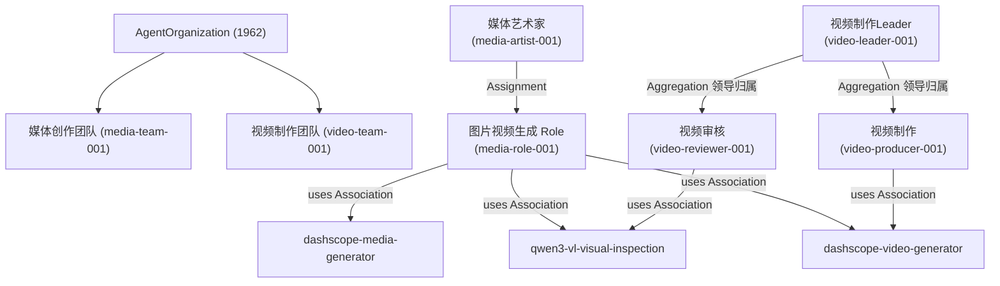
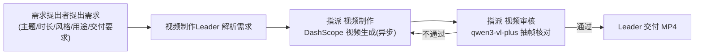

# ArchGraph · Agent 组织与协作梳理

> 依据：意图架构图谱 `design/KG/SystemArchitecture.json`（`AgentOrganization`(1962) 挂载的组织结构）
> 范围：`Business Actor` 及其能力（Skill）、协作关系、被卷入的主要业务流程
> 配套交付：`actor-explainer.mp4`（讲解视频）

## 一、团队总览

ArchGraph 的 Agent 组织根分组为 **AgentOrganization**(1962)，挂载于 Implementation and Migration Viewpoint(1249)，
下辖两个团队视图：**媒体创作团队**(media-team-001) 与 **视频制作团队**(video-team-001)。

共登记 **4 个 Business Actor**：

| Actor | id | 挂载点 | 一句话职责 |
|---|---|---|---|
| 媒体艺术家 | media-artist-001 | AgentOrganization(1962) | 图片与视频的创作执行（图像生成 + 视觉验收） |
| 视频制作Leader | video-leader-001 | AgentOrganization(1962) | 视频团队 Leader，统筹编排制作与验收 |
| 视频制作 | video-producer-001 | 视频制作Leader 之下 | 实际调用视频生成模型产出 MP4 |
| 视频审核 | video-reviewer-001 | 视频制作Leader 之下 | 用视觉模型验收生成视频是否达标 |

## 二、Actor 能力

### 1. 媒体艺术家（media-artist-001，agent: media-artist）
- **图像生成**：`dashscope-media-generator` Skill → DashScope 原生 text2image 接口
  （`qwen-image` / `qwen-image-plus`，异步 image-synthesis 任务、轮询、下载 PNG 至 `docs/diagrams/`）。
- **视觉验收**：`qwen3-vl-visual-inspection` Skill → `qwen3-vl-plus` 检查画面元素完整性、
  角色标注坐标、标注无遮挡/重叠。
- **视频生成**：`dashscope-video-generator` Skill → 万相 `wan2.7-t2v` / HappyHorse 等文生视频，异步合成 MP4。
- 模型：`alibaba-cn/qwen3.7-plus`；创作须符合仓库文档上下文，不得凭空捏造画面事实。

### 2. 视频制作Leader（video-leader-001，agent: video-leader）
- **需求解析**：解析主题、时长、分辨率、宽高比、风格、用途、交付要求。
- **统筹编排**：接收需求 → 指派「视频制作」生成 → 指派「视频审核」验收 → 通过后交付 MP4；不通过则返工。
- **最终责任**：对视频交付是否满足需求提出者要求负最终责任。

### 3. 视频制作（video-producer-001，agent: video-producer）
- **视频生成**：`dashscope-video-generator` Skill → `happyhorse-1.1-t2v` / `happyhorse-1.0-t2v` / 万相 `wan2.7-t2v`。
- **异步管线**：提交 video-synthesis 异步任务 → 轮询 task_id（约 15s 间隔）→ SUCCEEDED 后取 `output.video_url` 下载 MP4。
- **时效约束**：视频链接 24 小时有效，须立即下载转存至 `docs/diagrams/`。

### 4. 视频审核（video-reviewer-001，agent: video-reviewer）
- **抽帧核验**：抽取生成视频关键帧。
- **视觉分析**：`qwen3-vl-visual-inspection` Skill → `qwen3-vl-plus` 分析帧画面。
- **逐条核对**：画面元素完整性、内容是否符合主题、时长与分辨率、文字/标注是否准确无遮挡；
  输出「符合 / 不符合 + 依据」，供 Leader 决定交付或返工。

## 三、协作关系

- **媒体艺术家** 通过 `Assignment` 被指派为 **「图片视频生成」Business Role**，该 Role 通过 `Association` 使用 3 个 Skill（图像生成 / 视觉验收 / 视频生成）。
- **视频制作Leader** 通过 `Aggregation` 归属 **「视频制作」** 与 **「视频审核」** 两个 Actor（均挂载于 Leader 之下）。
- **视频制作** 使用 `dashscope-video-generator`；**视频审核** 使用 `qwen3-vl-visual-inspection`。
- 两个团队共享 Skill 资产：`dashscope-video-generator`（media-video-skill-001）与 `qwen3-vl-visual-inspection`（media-vl-skill-001）同时出现在媒体创作团队与视频制作团队视图中。

## 四、被卷入的主要业务流程

### 流程 A：视频制作流程（Leader 统筹，核心流程）

1. **需求接收**：需求提出者 → 视频制作Leader（主题、时长、分辨率、宽高比、风格、用途、交付要求）。
2. **任务指派（制作）**：Leader → 视频制作 → `dashscope-video-generator` 异步生成 → 下载 MP4。
3. **任务指派（验收）**：Leader → 视频审核 → 抽帧 + `qwen3-vl-plus` 逐条核对。
4. **交付 / 返工**：符合 → Leader 交付最终 MP4；不符合 → 返工重制，直至通过。

> 实证案例：《换一换》亲子短剧（2026-08-23）——6 场拆 16 段 HappyHorse 生成，qwen3-vl-plus 验收 13 符合/3 部分符合；
> 返工整合（定妆照 r2v 保角色一致 + cosyvoice 配音 + ffmpeg 拼接混音）后 8 段全符合交付。

### 流程 B：媒体创作流程（媒体艺术家）
需求（主题/风格/用途/数量/尺寸）→ 图像生成（`qwen-image`/`qwen-image-plus`）→ 视觉验收迭代（`qwen3-vl-plus` 检查元素/标注）→ 输出 PNG 至 `docs/diagrams/`；视频类任务走 `dashscope-video-generator` 异步产出 MP4。

### 流程 C：洞察 / 研究工作流（项目级，与 Agent 组织并列）
`多智能体协作系统研究方法`(1449) 以 ChiefEditorAgent 编排，Editor/Research/Writer/Reviewer/Reviser/FactChecker/Visualizer/Publisher 多角色协作产出洞察交付物；Actor 组织（媒体创作/视频制作）为其提供图像与视频呈现支持。

## 五、工具链（Skill）清单

| Skill | id | 用途 |
|---|---|---|
| dashscope-media-generator | media-skill-001 | 图像生成（qwen-image / qwen-image-plus，原生 text2image） |
| dashscope-video-generator | media-video-skill-001 | 视频生成（万相 wan2.7-t2v / HappyHorse，异步合成 MP4） |
| qwen3-vl-visual-inspection | media-vl-skill-001 | 视觉验收（qwen3-vl-plus，画面元素 / 标注坐标 / 无遮挡） |

> 凭据统一从 `argo/.env` 的 `QWEN_KEY` 读取，禁止写入文件/日志/提交内容。
