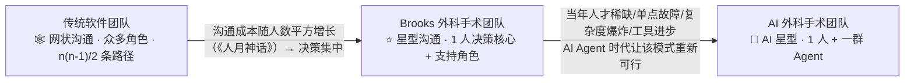
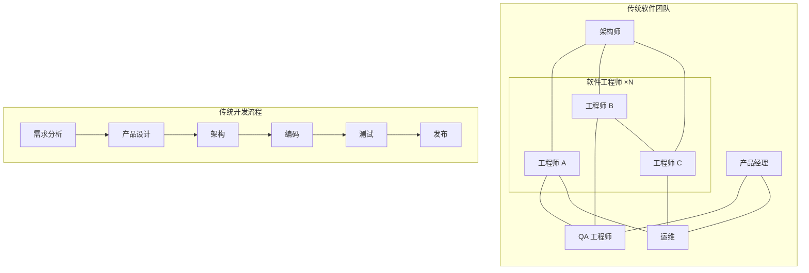
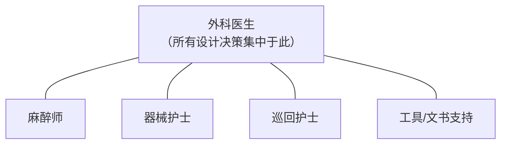
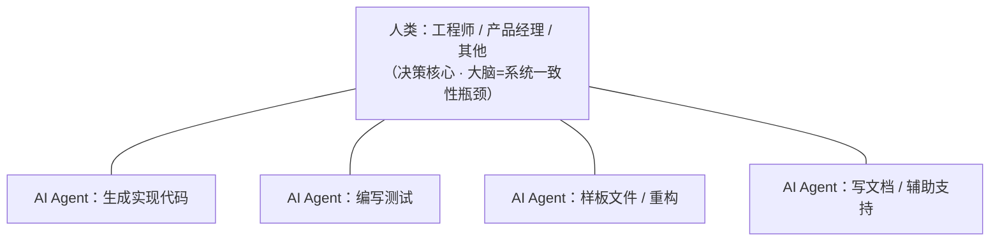

# 从人月神话到 AI 外科手术团队 · 组织架构演变图

> 依据：一段关于「康威定律 / 传统软件团队分工 / Brooks 外科手术团队 / AI Agent 时代」的论述
> 主交付物：`组织架构图.png`（AI 生成 · 白底简洁科技风）
> 本文件：Mermaid 精确版组织架构图 + 全角色文字明细（作为图片的精确文字对照；图片四周角色以无文字圆点呈现，具体角色明细以本文件为准）

## 一张图看懂演变

> 康威定律：**有什么样的沟通结构，就造出什么样的系统架构**；反过来，系统架构也决定组织架构。三张组织架构图，正是沟通拓扑从「网状 → 星型 → AI 星型」的演变。

## ① 传统软件团队组织架构（网状沟通）

围绕传统软件工程分工，角色多、沟通路径爆炸：

- **沟通成本**（《人月神话》）：n 个人有 **n(n-1)/2** 条沟通路径，成本随人数平方增长。
- 系统越复杂，个人越难完整掌握所有能力，只能依赖团队分工协作 → 网状沟通不可避免。

## ② Brooks 外科手术团队组织架构（星型沟通）

把设计决策集中在一个人（外科医生）脑中，其余全是支持角色：

- 沟通路径从**网状变星型**：层级减少，沟通成本平方值大幅下降。
- 10 人左右小团队真正做设计决策的只有 1 人，但产出远超 1 人上限——外科医生的认知带宽被全部释放到「思考与决策」。
- **当年为何没流行**：外科医生级人才稀缺；高度依赖个人（离开/误判则团队瘫痪）；系统复杂度爆炸后一人掌握全部设计细节不现实；版本控制/IDE/CI/CD 让部分辅助角色自然消亡。

## ③ AI 外科手术团队组织架构（AI 星型沟通）

AI Agent 时代，Coding 能力变强，Brooks 模式重新可行——**1 个能定义问题、有判断力的人 + 一群 Agent = 一个完整交付单元**：

- **决策权高度集中在一个人脑中**，执行力被极大放大；AI 不需要对齐会议的上下文，直接读代码 → 沟通成本极低。
- **瓶颈仍在人类大脑**：AI 加速执行，但没有扩大人类工作记忆容量——一个人能同时驾驭的系统复杂度并未同比例增长。
- **超大规模系统仍需分工**：几个「外科医生」各带自己的 AI 团队分头推进不同模块，靠设计好的接口契约保持松耦合。
- 只有 AGI 真正到来、AI 能完全替代人类做系统级决策的那天，这个瓶颈才可能被真正突破。
