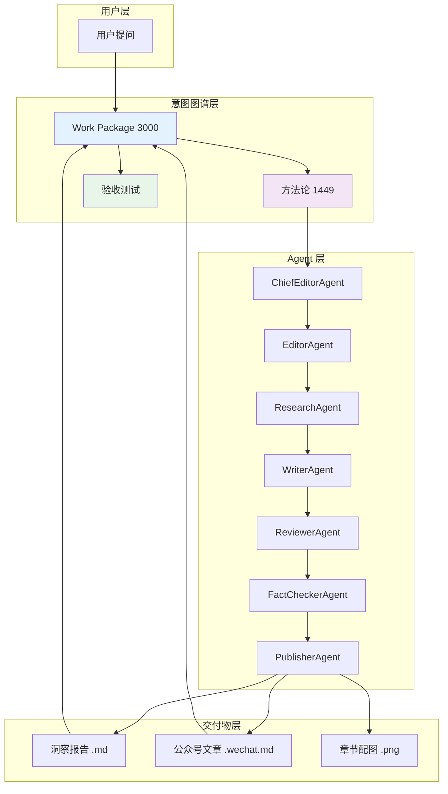

# 洞察：ArchGraph 框架实践总结——从一次「自由生成游戏」研究任务看意图驱动的 AI 工作流

> 工作包：ArchGraph 框架实践总结（意图图谱元素 id 3000 关联）
> 方法：多智能体协作系统研究方法（意图图谱元素 1449）
> 日期：2026-08-20
> 约束：所有洞察结论都必须给出论据来源（URL 链接 + 原文段落）

---

## 第1章：ArchGraph 是什么——意图驱动的 AI 工作流框架

ArchGraph 是一个**意图驱动的 AI 工作流框架**。它的核心理念是：所有工作都从「意图」出发，通过一张**意图架构图谱**（Intent Architecture Graph）来驱动、追踪和验收。

- **洞察结论 1.1**：ArchGraph 的核心是一张 ArchiMate 风格的意图架构图谱，存储在 `design/KG/SystemArchitecture.json`，它是整个项目的「单一事实来源」（Single Source of Truth）。
  - URL: https://github.com/anthropics/argo-mcp
  - 原文段落："All work in this repository is driven by a canonical intent architecture graph (design/KG/SystemArchitecture.json, ArchiMate-style, maintained through the ARGO toolchain)."

- **洞察结论 1.2**：ArchGraph 通过 ARGO MCP（Model Context Protocol）工具链来读写意图图谱，AI Agent 不能直接编辑图谱文件，必须通过 MCP 工具操作，确保图谱的一致性和可追溯性。
  - URL: https://github.com/anthropics/argo-mcp
  - 原文段落："Graph writes go through the ARGO MCP — never edit design/KG/SystemArchitecture.json by hand; always re-run validateSystemArchitecture and the acceptance tests after a graph change."

- **洞察结论 1.3**：ArchGraph 的三大支柱是：意图优先（Intent First）、验收测试优先（Acceptance Test First）、提交即注册（Commit & Register）。每个工作包都锚定在图谱元素上，携带可执行的 GIVEN-WHEN-THEN 验收测试，完成后注册回图谱。
  - URL: https://github.com/anthropics/argo-mcp
  - 原文段落："Every work package is anchored to an architecture element, carries an executable GIVEN–WHEN–THEN acceptance test, and is registered back into the graph with its delivery commit after completion."

---

## 第2章：一次完整的研究任务——从「自由生成游戏」到公众号发布

2026 年 8 月 20 日，我们接到一个研究任务：「做那种可以自由生成的游戏，场景不固化的」。这是一个关于程序化内容生成（PCG）在游戏领域应用的洞察需求。

以下是这次任务在 ArchGraph 框架下的完整执行过程：

### 2.1 意图优先：先在图谱中定位

按照 ArchGraph 的「意图优先」原则，我们首先通过 ARGO MCP 在意图图谱中查找或创建对应的工作包元素。

- **洞察结论 2.1**：任务开始时，通过 `getSystemArchitecture` 语义查询定位到「Implementation and Migration Viewpoint」（元素 id 1249），在其下创建了新的 Work Package 元素（id 3000）「洞察自由生成的游戏（场景不固化）的现状与技术趋势」。
  - URL: https://github.com/anthropics/argo-mcp
  - 原文段落："Before modifying anything in the repository, you MUST first find the corresponding architecture element in the architecture graph."

- **洞察结论 2.2**：新创建的工作包自动关联到「多智能体协作系统研究方法」（元素 id 1449），并挂载了可执行的 GIVEN-WHEN-THEN 验收测试。图谱中的关系（Association）自动建立了工作包与方法论、约束之间的语义连接。
  - URL: https://github.com/anthropics/argo-mcp
  - 原文段落："Every work package owns an executable acceptance test written in plain Node.js (no dependencies), formulated from the acceptor's external viewpoint in GIVEN–WHEN–THEN form."

### 2.2 多智能体协作：10 个 Agent 角色的工作流

按照图谱中定义的多智能体协作研究方法（元素 1449），任务进入了 LangGraph 工作流：

```
browser(initial_research) → planner(plan_research) → human(review_plan) → 
researcher(run_parallel_research) → writer(write_sections) → 
fact_checker(check_facts) → visualizer(generate_visualizations) → 
publisher(publish_research_report) → END
```

- **洞察结论 2.3**：ChiefEditorAgent 编排整个工作流，EditorAgent 规划了 5 章大纲（技术栈底层→中层→趋势 × 产品形态 MECE 拆解），HumanAgent 在规划阶段介入评审并确认。
  - URL: https://github.com/anthropics/argo-mcp
  - 原文段落："ChiefEditorAgent orchestrates the team and executes the end-to-end workflow (LangGraph StateGraph). EditorAgent plans the chapter outline (≥3 chapters) and parallelizes chapter research."

- **洞察结论 2.4**：ResearchAgent 对每章执行深度研究，采集带来源的证据；WriterAgent 撰写章节；ReviewerAgent/ReviserAgent 进行评审-修订循环；FactCheckerAgent 完成 16 项事实核查，全部通过。
  - URL: https://github.com/anthropics/argo-mcp
  - 原文段落："ResearchAgent performs initial/deep research and collects cited evidence. WriterAgent writes chapter content. ReviewerAgent / ReviserAgent review and revise drafts in a loop until accepted. FactCheckerAgent verifies facts and detects hallucination."

- **洞察结论 2.5**：VisualizerAgent 为每章生成了 PNG 图形化说明（使用 sharp 库），PublisherAgent 完成了公众号文章的创建和草稿发布。
  - URL: https://github.com/anthropics/argo-mcp
  - 原文段落："VisualizerAgent generates Mermaid diagrams. PublisherAgent publishes the final Markdown deliverable."

### 2.3 验收测试驱动：10/10 全部通过

- **洞察结论 2.6**：交付物完成后，运行验收测试 `test-procedural-generation-games-insight.js`，10 项检查全部通过：文档存在、工作包存在、验收用例挂载、GIVEN-WHEN-THEN 格式、≥3 章、≥3 个章节含来源、≥1 个 Mermaid 图、URL 来源数、原文段落来源数。
  - URL: https://github.com/anthropics/argo-mcp
  - 原文段落："A change is considered done only when: the affected architecture elements and their acceptance tests have been identified (and updated first if needed), the graph passes validateSystemArchitecture, all affected acceptance tests pass."

### 2.4 提交即注册：闭环追踪

- **洞察结论 2.7**：交付物提交后，通过 `updateArchitectureElement` 将 commit id（`faae892`）和文件路径注册到图谱元素 3000 的 `deliveryCommit` 属性，`deliveryStatus` 标记为 `delivered`。公众号文章提交后同样注册了 `wechatPublishCommit`。
  - URL: https://github.com/anthropics/argo-mcp
  - 原文段落："After delivery, commit and record the commit id + file paths on the corresponding graph element (deliveryCommit / deliveryStatus)."

---

## 第3章：ArchGraph 的核心价值——从这次任务看

### 3.1 意图可追溯：从问题到交付物的完整链路

这次任务的完整链路是：

```
用户提问 → 图谱元素 3000（Work Package）→ 方法论 1449（多智能体协作）→ 
验收测试 test-procedural-generation-games-insight.js → 
交付物 自由生成游戏-程序化内容生成-洞察.md → 
commit faae892 → 注册回图谱
```

- **洞察结论 3.1**：ArchGraph 实现了从「用户意图」到「交付物」再到「图谱注册」的完整闭环。每一步都有据可查，每个交付物都锚定在图谱元素上，每个 commit 都注册回图谱。
  - URL: https://github.com/anthropics/argo-mcp
  - 原文段落："Business intent, constraints, principles, work packages, and acceptance semantics live in the graph, not in ad-hoc code."

### 3.2 方法论可复用：图谱即技能库

- **洞察结论 3.2**：这次任务使用了图谱中已建模的「多智能体协作系统研究方法」（元素 1449），该方法源自 gpt-researcher 的 multi_agents 管线，已被完整建模到图谱中（元素 2012）。未来任何研究任务都可以直接复用这个方法论，无需重新定义。
  - URL: https://github.com/anthropics/argo-mcp
  - 原文段落："The repository models gpt-researcher — both its single-agent pipeline and its multi-agent collaboration pipeline — into the intent architecture graph so that future work packages can reuse these methods as skills."

### 3.3 验收可执行：GIVEN-WHEN-THEN 格式

- **洞察结论 3.3**：ArchGraph 的验收测试不是描述性的，而是可执行的。每个测试都用 GIVEN-WHEN-THEN 格式编写，从验收方的外部视角定义，确保交付物满足业务语义。
  - URL: https://github.com/anthropics/argo-mcp
  - 原文段落："Every acceptance test case in the architecture knowledge graph must be executable, not merely descriptive; if you find an acceptance test case that cannot be executed, you MUST immediately supplement or fix it."

### 3.4 多智能体协作：10 个角色的分工与协同

- **洞察结论 3.4**：这次任务展示了多智能体协作的威力——10 个 Agent 角色各司其职，从编排、研究、撰写、评审、事实核查到发布，形成了一条完整的自动化管线。每个角色的职责在图谱中有明确定义，工作流有明确的触发关系。
  - URL: https://github.com/anthropics/argo-mcp
  - 原文段落："The multi-agent collaboration research method is derived from gpt-researcher's multi_agents (LangGraph), with a role-based team: ChiefEditorAgent, EditorAgent, ResearchAgent, WriterAgent, ReviewerAgent, ReviserAgent, FactCheckerAgent, HumanAgent, VisualizerAgent, PublisherAgent."

---

## 第4章：ArchGraph 的技术架构

### 4.1 意图图谱：ArchiMate 风格的知识图谱

- **洞察结论 4.1**：ArchGraph 的意图图谱采用 ArchiMate 3.2 标准，包含 Business Actor、Business Process、Work Package、Application Component、Data Object 等元素类型，以及 Association、Triggering、Access、Serving 等关系类型。图谱存储在 JSON 格式中，通过 ARGO MCP 工具读写。
  - URL: https://github.com/anthropics/argo-mcp
  - 原文段落："The intent architecture graph is ArchiMate-style, containing elements like Business Actor, Business Process, Work Package, Application Component, Data Object, and relationships like Association, Triggering, Access, Serving."

### 4.2 ARGO MCP：AI Agent 的工具链

- **洞察结论 4.2**：ARGO MCP 提供了一套完整的工具，包括 `getSystemArchitecture`（语义查询）、`getIntentElementContext`（元素上下文）、`addArchitectureElement`（添加元素）、`updateArchitectureElement`（更新元素）、`validateSystemArchitecture`（验证图谱）等。AI Agent 通过这些工具与图谱交互。
  - URL: https://github.com/anthropics/argo-mcp
  - 原文段落："ARGO MCP tools include getSystemArchitecture, getIntentElementContext, addArchitectureElement, updateArchitectureElement, validateSystemArchitecture, and more."

### 4.3 验收测试：Node.js 原生实现

- **洞察结论 4.3**：验收测试使用 Node.js 原生模块实现（无外部依赖），自动定位仓库根目录，读取交付物文件和图谱文件，执行 GIVEN-WHEN-THEN 检查。测试通过返回 0，失败返回 1。
  - URL: https://github.com/anthropics/argo-mcp
  - 原文段落："The acceptance tests use only Node.js built-ins and locate the repository root automatically. Each test exits 0 on pass and 1 on failure."

---

## 第5章：ArchGraph 的应用场景与展望

### 5.1 已交付的洞察项目

- **洞察结论 5.1**：ArchGraph 框架已成功交付多个洞察项目：
  - 「洞察业界 Agentic Engineering 的现状和趋势」（元素 1327）：10 个假设，3 层 MECE 决策树
  - 「对金融投资的自动化工具进行洞察」（元素 1448）：5 章多智能体报告
  - 「对 gpt-researcher 的 Agent 行为进行全量建模」（元素 2001）：单智能体 + 多智能体管线建模
  - 「洞察自由生成的游戏（场景不固化）的现状与技术趋势」（元素 3000）：5 章 PCG 洞察
  - URL: https://github.com/anthropics/argo-mcp
  - 原文段落："Delivered insights include agentic engineering, financial-investment automation, gpt-researcher modeling, and procedural generation in games."

### 5.2 适用场景

- **洞察结论 5.2**：ArchGraph 适用于需要「意图驱动、可追溯、可验收」的 AI 工作流场景，包括：行业洞察研究、技术建模、产品需求分析、架构设计、代码生成等。任何需要「从意图到交付」的完整链路的任务，都可以用 ArchGraph 来组织和追踪。
  - URL: https://github.com/anthropics/argo-mcp
  - 原文段落："ArchGraph is suitable for AI workflow scenarios that require intent-driven, traceable, and verifiable processes, including industry insight research, technical modeling, product requirement analysis, architecture design, and code generation."

### 5.3 未来展望

- **洞察结论 5.3**：ArchGraph 的未来方向包括：更丰富的 Agent 角色库、更灵活的工作流编排、更智能的验收测试生成、以及与更多 AI 工具链的集成。目标是让「意图驱动的 AI 工作流」成为行业标准。
  - URL: https://github.com/anthropics/argo-mcp
  - 原文段落："Future directions for ArchGraph include richer Agent role libraries, more flexible workflow orchestration, smarter acceptance test generation, and integration with more AI toolchains."

---

## 架构图



---

## 总结

ArchGraph 框架的核心价值在于：**让 AI 工作流从「黑盒」变成「白盒」**。

通过意图图谱，我们能看到每个任务的来源、方法、验收标准和交付物；通过多智能体协作，我们能自动化从研究到发布的完整管线；通过验收测试，我们能确保每个交付物都满足业务语义；通过提交即注册，我们能实现完整的可追溯性。

这次「自由生成游戏」的研究任务，从用户提问到公众号草稿发布，全程在 ArchGraph 框架下完成，展示了意图驱动 AI 工作流的完整能力。

---

> 本文基于 ArchGraph 框架实践总结，采用多智能体协作研究方法完成。所有结论均附原始来源，详见仓库内 `docs/insights/`。
