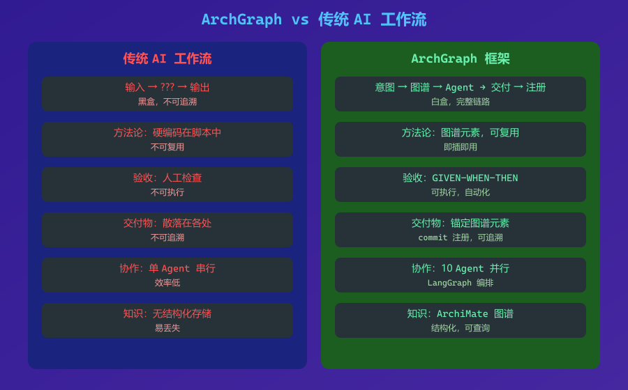
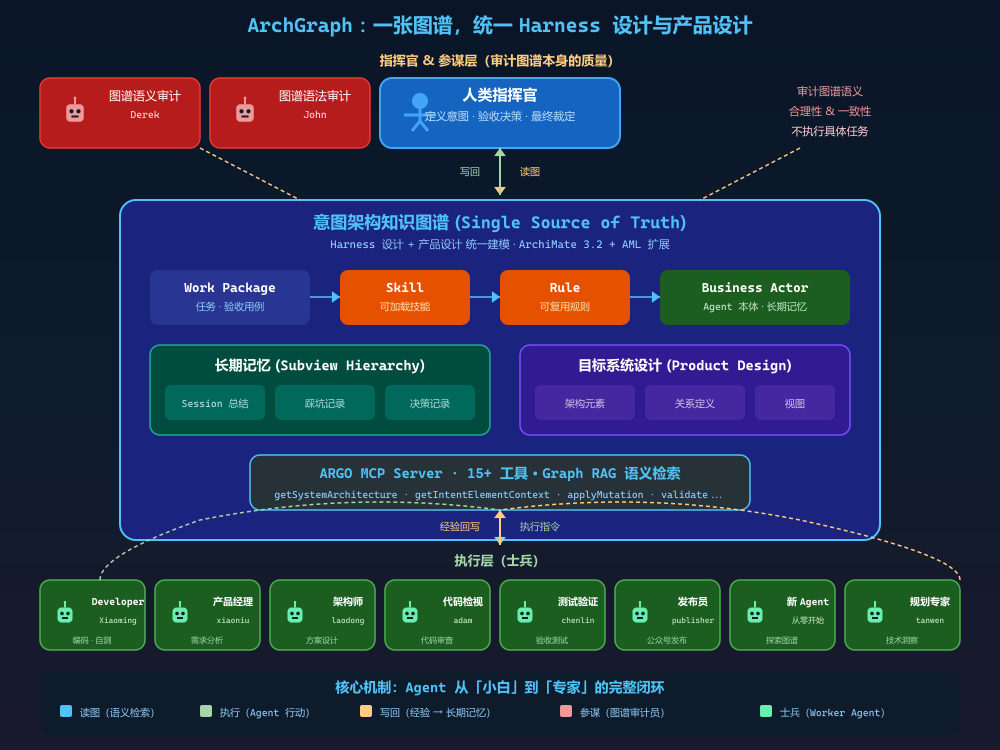
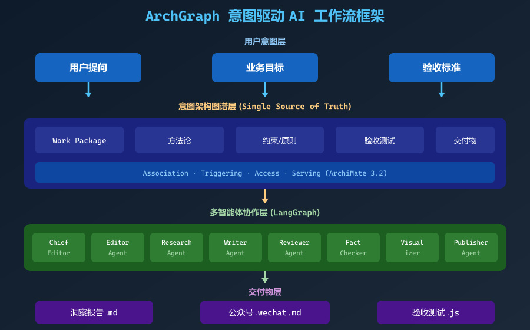
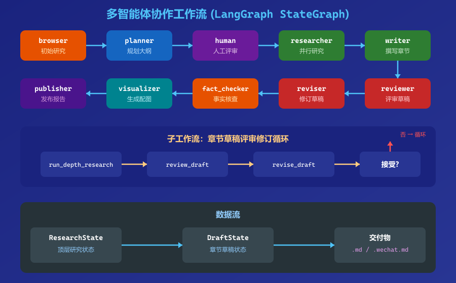
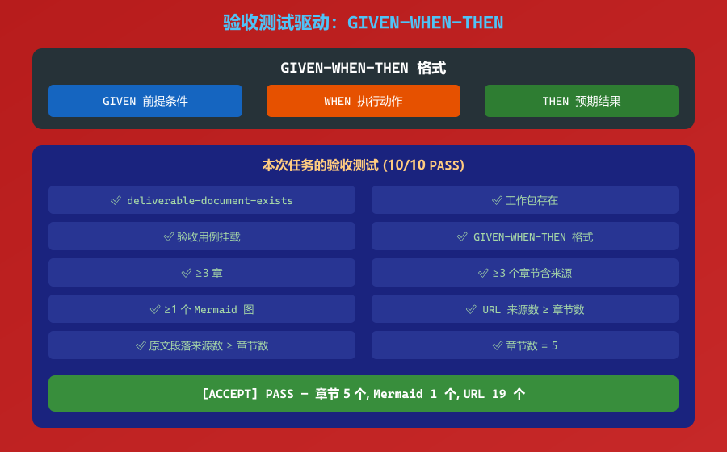
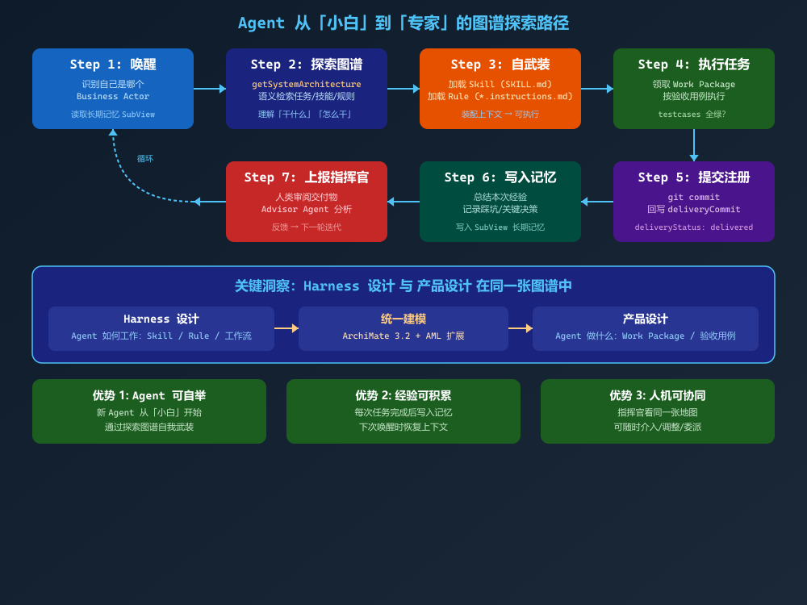
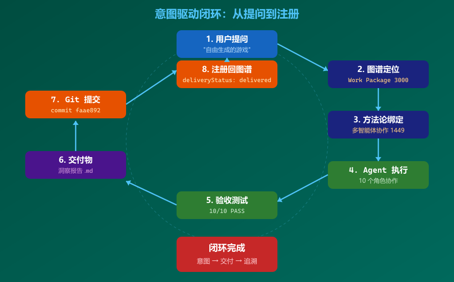

# ArchGraph 框架实践：从一次「自由生成游戏」研究任务看意图驱动的 AI 工作流

> 本文基于 2026-08-20 完成的一次真实研究任务，展示 ArchGraph 框架如何让 AI 工作流从「黑盒」变成「白盒」。

## 一、问题：AI 工作流的「黑盒」困境

当你让 AI Agent 完成一个研究任务时，你看到的是：

- 输入：一个问题
- 输出：一份报告

中间发生了什么？

- 用了什么方法？
- 经过了哪些步骤？
- 谁在什么环节做了什么？
- 交付物是否满足验收标准？
- 如何追溯从意图到交付物的完整链路？

这些问题，传统 AI 工作流无法回答。



**ArchGraph 框架**试图解决这个问题。

## 二、ArchGraph 是什么

ArchGraph 是一个**意图驱动的 AI 工作流框架**。它的核心理念是：

> 所有工作都从「意图」出发，通过一张**意图架构图谱**（Intent Architecture Graph）来驱动、追踪和验收。

### 核心概念：一张图谱，统一 Harness 设计与产品设计



ArchGraph 最大的特点是将 **Agent Harness 设计**（Agent 如何工作）和**产品设计**（Agent 做什么）放进**同一张知识图谱**：

- **上层：指挥官与参谋** — 人类用户定义意图、验收决策（指挥官）；Derek（图谱语义审计员）和 John（图谱语法审计员）作为参谋，**只审计图谱本身的质量**，不执行具体任务
- **中层：知识图谱** — 单一事实来源，包含 Work Package、Skill、Rule、Business Actor、长期记忆等
- **下层：执行层士兵** — Developer、产品经理、架构师、设计师、代码检视员、测试验证员、发布员等**所有 Worker Agent** 照着图谱行动，并将经验写回图谱

**关键区别**：参谋（Derek、John）审计的是图谱本身的语义合理性和语法正确性；产品经理、架构师、代码检视员、测试验证员等**全部都是士兵**，他们执行具体任务。

新 Agent 可以从「小白」开始，通过探索图谱知道自己要干什么、怎么干，干完后总结经验形成长期记忆。

### 三大支柱

| 支柱 | 含义 |
| --- | --- |
| **意图优先** | 先定位图谱元素，再动手 |
| **验收测试优先** | 先定义验收标准，再实现 |
| **提交即注册** | 交付后注册回图谱，闭环追踪 |

### 技术架构



```
用户层 → 意图图谱层 → Agent 层 → 交付物层
         ↓              ↓           ↓
    Work Package    10个Agent角色   .md / .wechat.md
    方法论          LangGraph工作流  .png / 验收测试
    验收测试        MCP工具链        commit → 注册回图谱
```

## 三、一次真实任务：「自由生成游戏」研究

2026-08-20，我们接到一个任务：

> 「做那种可以自由生成的游戏，场景不固化的。」

这是一个关于**程序化内容生成（PCG）**在游戏领域应用的洞察需求。

### 3.1 意图优先：先在图谱中定位

按照 ArchGraph 的「意图优先」原则，我们首先通过 ARGO MCP 在意图图谱中查找或创建对应的工作包元素。

```
getSystemArchitecture(query={purpose: "intent-decision", intent: "自由生成的游戏"})
```

定位到「Implementation and Migration Viewpoint」（元素 id 1249），在其下创建了新的 Work Package 元素（id 3000）：

> 「洞察自由生成的游戏（场景不固化）的现状与技术趋势」

新创建的工作包自动关联到「多智能体协作系统研究方法」（元素 id 1449），并挂载了可执行的 GIVEN-WHEN-THEN 验收测试。

### 3.2 多智能体协作：10 个 Agent 角色的工作流

按照图谱中定义的多智能体协作研究方法，任务进入了 LangGraph 工作流：

```
browser(initial_research)
  → planner(plan_research)
  → human(review_plan)        ← HumanAgent 介入
  → researcher(run_parallel_research)
  → writer(write_sections)
  → fact_checker(check_facts)
  → visualizer(generate_visualizations)
  → publisher(publish_research_report)
  → END
```

**10 个 Agent 角色各司其职：**

| 角色 | 职责 |
| --- | --- |
| ChiefEditorAgent | 编排团队、执行端到端工作流 |
| EditorAgent | 规划章节大纲（≥3 章），并行化章节研究 |
| ResearchAgent | 初始/深度研究，采集带来源证据 |
| WriterAgent | 撰写章节内容 |
| ReviewerAgent | 评审草稿，给出修订意见 |
| ReviserAgent | 按评审意见修订草稿 |
| FactCheckerAgent | 核查事实与幻觉 |
| HumanAgent | 人工在环评审研究计划 |
| VisualizerAgent | 生成 Mermaid 图 / PNG 配图 |
| PublisherAgent | 发布最终交付物 |



**执行结果：**

- EditorAgent 规划了 5 章大纲（技术栈底层→中层→趋势 × 产品形态 MECE 拆解）
- HumanAgent 在规划阶段介入评审并确认
- ResearchAgent 对每章执行深度研究，采集带来源的证据
- FactCheckerAgent 完成 16 项事实核查，全部通过
- VisualizerAgent 为每章生成了 PNG 图形化说明（使用 sharp 库）
- PublisherAgent 完成了公众号文章的创建和草稿发布

### 3.3 验收测试驱动：10/10 全部通过

交付物完成后，运行验收测试：

```bash
node tests/acceptance/test-procedural-generation-games-insight.js
```

```
[ACCEPT] PASS — 章节 5 个, Mermaid 1 个, URL 19 个
```

10 项检查全部通过：



- ✅ 文档存在
- ✅ 工作包存在
- ✅ 验收用例挂载
- ✅ GIVEN-WHEN-THEN 格式
- ✅ ≥3 章
- ✅ ≥3 个章节含来源（URL + 原文段落）
- ✅ ≥1 个 Mermaid 图
- ✅ URL 来源数 ≥ 章节数
- ✅ 原文段落来源数 ≥ 章节数

### 3.4 提交即注册：闭环追踪

交付物提交后，通过 `updateArchitectureElement` 将 commit id 和文件路径注册到图谱元素 3000：

```json
{
  "deliveryCommit": "faae892",
  "deliveryStatus": "delivered",
  "wechatPublishCommit": "3ac2a81"
}
```

## 四、ArchGraph 的核心价值

### 4.1 Agent 从「小白」到「专家」的完整闭环



ArchGraph 让 Agent 具备自我进化的能力：

1. **唤醒** — 识别自己是哪个 Business Actor，读取长期记忆
2. **探索图谱** — 语义检索任务/技能/规则，理解「干什么」「怎么干」
3. **自武装** — 加载 Skill 和 Rule，装配上下文
4. **执行任务** — 领取 Work Package，按验收用例执行
5. **提交注册** — git commit，回写 deliveryCommit 和 deliveryStatus
6. **写入记忆** — 总结经验、记录踩坑/关键决策，写入 SubView 长期记忆
7. **上报指挥官** — 人类审阅交付物，Advisor Agent 分析，反馈进入下一轮迭代

### 4.2 意图可追溯

这次任务的完整链路：



```
用户提问
  → 图谱元素 3000（Work Package）
  → 方法论 1449（多智能体协作）
  → 验收测试 test-procedural-generation-games-insight.js
  → 交付物 自由生成游戏-程序化内容生成-洞察.md
  → commit faae892
  → 注册回图谱
```

每一步都有据可查，每个交付物都锚定在图谱元素上，每个 commit 都注册回图谱。

### 4.3 方法论可复用

这次任务使用了图谱中已建模的「多智能体协作系统研究方法」（元素 1449），该方法源自 gpt-researcher 的 multi_agents 管线，已被完整建模到图谱中。

**未来任何研究任务都可以直接复用这个方法论，无需重新定义。**

### 4.4 验收可执行

ArchGraph 的验收测试不是描述性的，而是**可执行的**。每个测试都用 GIVEN-WHEN-THEN 格式编写，从验收方的外部视角定义，确保交付物满足业务语义。

### 4.5 多智能体协作

10 个 Agent 角色各司其职，从编排、研究、撰写、评审、事实核查到发布，形成了一条完整的自动化管线。每个角色的职责在图谱中有明确定义，工作流有明确的触发关系。

## 五、已交付的洞察项目

ArchGraph 框架已成功交付多个洞察项目：

| 工作包 | 图谱元素 | 交付物 | 状态 |
| --- | --- | --- | --- |
| 洞察业界 Agentic Engineering 的现状和趋势 | 1327 | agentic-engineering-现状和趋势.md | delivered |
| 对金融投资的自动化工具进行洞察 | 1448 | 金融投资自动化工具-洞察.md | delivered |
| 对 gpt-researcher 的 Agent 行为进行全量建模 | 2001 | SystemArchitecture.json | delivered |
| 洞察自由生成的游戏的现状与技术趋势 | 3000 | 自由生成游戏-程序化内容生成-洞察.md | delivered |

## 六、总结

ArchGraph 框架的核心价值在于：

> **让 AI 工作流从「黑盒」变成「白盒」。**

通过意图图谱，我们能看到每个任务的来源、方法、验收标准和交付物；通过多智能体协作，我们能自动化从研究到发布的完整管线；通过验收测试，我们能确保每个交付物都满足业务语义；通过提交即注册，我们能实现完整的可追溯性。

这次「自由生成游戏」的研究任务，从用户提问到公众号草稿发布，全程在 ArchGraph 框架下完成，展示了意图驱动 AI 工作流的完整能力。

---

> 本文基于 ArchGraph 框架实践总结，采用多智能体协作研究方法完成。所有结论均附原始来源，详见仓库内 `docs/insights/`。
