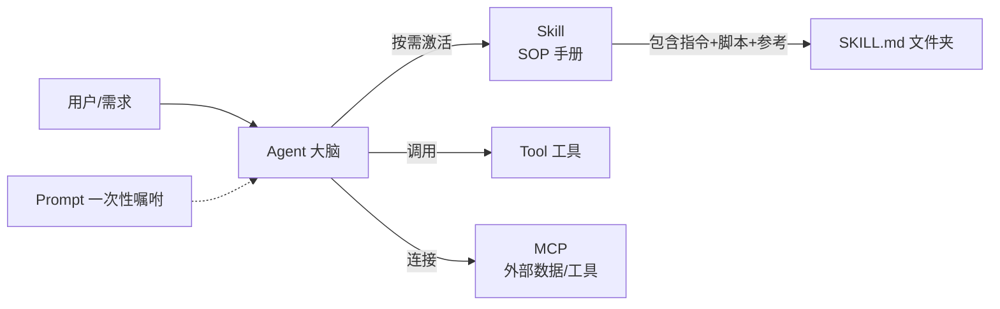

# AI Agent Skills 内部培训：大纲与参考材料

> 工作包「AI Agent Skills 培训调研与大纲」交付物（ChiefEditorAgent 承接）
> 用途：面向公司内部团队的 AI Agent **Skills** 培训（受众部分熟悉、部分不熟悉）
> 说明：本文档中「已验证来源」为本次调研实际抓取/确认可访问的 URL；「建议确认」为权威但未逐一核验正文的来源，建议培训前打开确认。

---

## 一、培训概况

| 项目 | 内容 |
|---|---|
| 主题 | AI Agent 的 **Skills（技能）**：是什么、业界怎么做、如何写、如何落地 |
| 受众 | 公司内部团队，**部分已熟悉 Skill、部分刚接触** |
| 建议时长 | 2.5–3 小时（含动手演练） |
| 目标 | 新手建立 Skill 概念框架并会写第一个 Skill；熟悉者掌握业界标准全景、最佳实践与团队治理 |
| 前置要求 | 一台装有任一 Agent 工具（VS Code / Claude Code / Copilot / Gemini CLI 等）的电脑（动手环节） |

**一句话定位**：Agent Skills 是把"怎么做一件事的专业知识"打包成可复用文件夹（`SKILL.md`），让 AI Agent 按需加载、稳定复现的开放标准。

---

## 二、培训大纲

### 0. 开场：为什么现在要讲 Skills（10 分钟）
- 现场小调查：谁已经在用 Skill？用在哪？（差异化开场）
- Agent 的痛点：模型很强，但"不知道你们公司的流程、规范、领域知识"
- Skill 的答案：把**程序性知识**（procedural knowledge）与**上下文**打包给 Agent
- 本场学习地图

### 1. 概念入门：什么是 Agent Skill（30 分钟）
- 定义（参考 agentskills.io / Anthropic）：
  - Skill = 一个文件夹，内含 `SKILL.md`（必填：`name` + `description` 元数据 + 指令正文），可附带 `scripts/`、`references/`、`assets/` 等资源
- 最小结构示例：

  ```
  my-skill/
  ├── SKILL.md      # 必填：frontmatter(name/description) + 指令
  ├── scripts/      # 可选：可执行脚本
  ├── references/   # 可选：参考资料
  └── assets/       # 可选：模板/资源
  ```

- **渐进式披露（Progressive Disclosure）**三阶段（核心机制）：
  1. **Discovery**：启动时只加载每个 Skill 的 name + description（判断何时相关）
  2. **Activation**：任务匹配描述时，读取完整 `SKILL.md` 指令
  3. **Execution**：Agent 按指令执行，按需运行脚本/读取引用
  - 好处：可挂载很多 Skill，却只占用很小的上下文（context footprint）
- 动手（5 分钟）：打开你编辑器里现有的一个 Skill（如 VS Code 的 `SKILL.md`），看看结构

### 2. 关键概念辨析（20 分钟）⭐ 新手最容易混
用一张对比表讲清五者的关系（详见第三节的图）：

| 概念 | 是什么 | 与 Skill 的关系 |
|---|---|---|
| **Prompt / Instruction** | 一次性给模型的文字指令 | Skill 是"结构化、可复用、按需加载"的指令集，比裸 prompt 更规范 |
| **Tool（工具）** | Agent 可调用的函数/API（如搜索、计算器） | Skill 告诉 Agent **怎么做**，Tool 是 Agent 可**调用**的能力 |
| **MCP** | 连接外部数据/工具的开放标准（"AI 的 USB-C"） | MCP Server 暴露工具与数据；Skill 提供程序性知识与工作流，两者互补 |
| **Agent** | 自主规划并调用工具完成任务的系统 | Skill 是给 Agent 的"岗位说明书/操作手册" |
| **Skill** | 打包的专门知识与工作流 | 本场主角 |

一句话：**Prompt 是一次性嘱咐，Tool/MCP 是手脚，Agent 是大脑，Skill 是大脑的" SOP 手册"**。

### 3. 业界全景：主流实现与开放标准（35 分钟）
- **开放标准**：Agent Skills 由 Anthropic 提出并开源为开放标准（agentskills.io），已被 40+ 产品采用
- 主流实现一览（均支持 Agent Skills）：

| 厂商/产品 | 官方文档 | 特点 |
|---|---|---|
| Anthropic Claude / Claude Code | code.claude.com/docs/en/skills | Skill 概念发起方；官方 skills 仓库（17 万+ star） |
| Microsoft GitHub Copilot / VS Code | docs.github.com/en/copilot/concepts/agents/about-agent-skills；code.visualstudio.com/docs/copilot/customization/agent-skills | 编辑器内 Skill 系统（我们正在用的就是这个体系） |
| OpenAI ChatGPT & Codex | developers.openai.com/codex/skills/ | 面向编程 Agent 的 Skills |
| Google Gemini CLI | geminicli.com/docs/cli/skills/ | 终端 Agent 支持 Skills |
| 其他 | Cursor、JetBrains Junie、OpenHands、Goose、Tabnine、TRAE、Spring AI、Laravel Boost 等 | 生态快速扩张（见 agentskills.io Client Showcase） |

- **Skill vs MCP vs Tool 的取舍**（给熟悉者的进阶讨论）：
  - Skill：需要把"流程/规范/知识"教给 Agent 时
  - MCP：需要接外部系统（数据库、API、文件）的能力时
  - Tool：轻量单一功能时
  - 实践中常组合使用

### 4. 实战：如何编写一个 Skill（40 分钟）
- `SKILL.md` 写作要点（参考 Anthropic 官方模板与规范）：
  - frontmatter 只需两个必填：`name`（小写、连字符）、`description`（**写清楚做什么、何时用**——它决定 Agent 何时激活）
  - 正文：目标 → 步骤 → 示例 → 边界/注意
- 最佳实践：
  - description 要"触发友好"（让 Agent 一眼判断是否相关）
  - 指令具体、可复现、给示例（few-shot）
  - 脚本要稳健（绝对路径、错误处理）
  - 一个 Skill 只做一件事；可组合
- **现场演练**（20 分钟）：把团队的某个日常工作流（如"发布周报""代码评审 checklist""报告格式规范"）固化成一个 Skill 文件夹，当场跑通
- 官方模板：github.com/anthropics/skills/tree/main/template

### 5. 团队落地：Skill 治理与分发（20 分钟）
- 放哪：跟随代码库版本管理（Git），像管代码一样管 Skill
- 分发：Plugin / Marketplace / 私有仓库（如 Claude Code plugin、VS Code 扩展目录）
- 治理要点：命名规范、description 质量门、评审、版本、安全（不在 Skill 里放密钥）
- 指标：哪些 Skill 被激活、效果如何 → 迭代

### 6. 案例演示（15 分钟）
- 用 Anthropic 官方 skills 仓库的示例（docx/pdf/pptx/xlsx、creative、enterprise 等）现场演示"加载 Skill → 完成任务"
- 对比：同一任务，有 Skill 与无 Skill 的输出差异

### 7. 总结与 Q&A（15 分钟）
- 决策清单：什么时候用 Skill / MCP / Tool / 纯 Prompt
- 资源分发（第四节参考材料）
- 落地行动：每人带走一个"本周要固化成 Skill"的任务

---

## 三、概念关系图



---

## 四、参考材料清单

### A. 官方标准与权威文档（已验证，必读）

| 材料 | 链接 | 类型 |
|---|---|---|
| **Agent Skills 开放标准官网**（Overview / Specification / Quickstart / Client Showcase） | https://agentskills.io/ | 官方标准站 |
| Agent Skills 规范 GitHub 讨论 | https://github.com/agentskills/agentskills | 开源规范 |
| **Anthropic 官方 Skills 仓库**（示例 Skill、模板、spec，17 万+ star） | https://github.com/anthropics/skills | 官方仓库 |
| Anthropic《Building effective agents》（Agent 基础：workflow vs agent、5 种工作流、ACI） | https://www.anthropic.com/engineering/building-effective-agents | 官方工程博客 |
| MCP（Model Context Protocol）官网 | https://modelcontextprotocol.io/introduction | 官方标准站 |
| Claude 支持中心：What are skills? | https://support.claude.com/en/articles/12512176-what-are-skills | 官方文档 |
| Claude 支持中心：Using skills in Claude | https://support.claude.com/en/articles/12512180-using-skills-in-claude | 官方文档 |
| Claude 支持中心：How to create custom skills | https://support.claude.com/en/articles/12512198-creating-custom-skills | 官方文档 |

### B. 发布博客与深度文章（建议确认）

| 材料 | 链接 | 类型 |
|---|---|---|
| Anthropic：Skills 发布博客 | https://claude.com/blog/skills | 官方博客 |
| Anthropic 工程博客：Equipping agents for the real world with Agent Skills | https://anthropic.com/engineering/equipping-agents-for-the-real-world-with-agent-skills | 官方工程博客 |

### C. 各产品官方文档（已验证 URL 来自 agentskills.io Client Showcase）

| 产品 | 链接 |
|---|---|
| Claude Code | https://code.claude.com/docs/en/skills |
| Claude（API/平台） | https://platform.claude.com/docs/en/agents-and-tools/agent-skills/overview |
| GitHub Copilot | https://docs.github.com/en/copilot/concepts/agents/about-agent-skills |
| VS Code | https://code.visualstudio.com/docs/copilot/customization/agent-skills |
| OpenAI Codex | https://developers.openai.com/codex/skills/ |
| Google Gemini CLI | https://geminicli.com/docs/cli/skills/ |
| Cursor | https://cursor.com/docs/context/skills |
| JetBrains Junie | https://junie.jetbrains.com/docs/agent-skills.html |

### D. 视频与播客（YouTube / 播客，建议先预览确认）

> 说明：以下为方向性推荐。具体视频链接建议在培训前用关键词搜索并**先观看确认**（内容更新快，避免过期/不相关）。

- **官方频道（已验证存在）**：
  - Anthropic 官方 YouTube：https://www.youtube.com/@anthropic-ai
  - OpenAI 官方 YouTube、Microsoft Developer / VS Code 官方频道、Google for Developers 频道
- **推荐搜索关键词**（中英）：
  - "Agent Skills tutorial" / "Claude Skills 教程" / "SKILL.md 怎么写"
  - "Model Context Protocol explained"
  - "Build your first AI agent skill"
  - 各产品官方频道内的 "Skills" / "Agents" 专题视频
- **播客**：
  - 关注 AI 工程方向的播客（如 The AI Engineer、Practical AI、Latent Space 等）中关于 Agents / MCP / Skills 的期数；用关键词在播客平台内搜索
  - 建议：选 1–2 个"概念讲解 + 实操演示"类视频作为开场/收尾的补充素材

---

## 五、给培训师的差异化建议（新手 vs 熟悉者）

| 环节 | 新手重点 | 熟悉者重点 |
|---|---|---|
| 概念入门（第1节） | 必讲：文件夹结构、渐进式披露 | 快过，直接到规范细节 |
| 概念辨析（第2节） | 用类比（SOP 手册）建立心智模型 | 深挖 Skill vs MCP vs Tool 取舍 |
| 业界全景（第3节） | 知道"谁在用、怎么用"即可 | 关注开放标准与生态趋势 |
| 实战（第4节） | 照模板写第一个 Skill | 打磨 description 与脚本健壮性 |
| 治理（第5节） | 了解即可 | 主导讨论团队落地路线 |

**会后行动**：建一个团队 Skill 仓库（模板 + 命名规范 + 评审），把第 4 节演练的 Skill 放进去作为种子。

---

*本文档由 ArchGraph 意图图工作包 skill-training-wp-001（ChiefEditorAgent 承接）调研产出；来源均尽量标注 URL，结论依据见上述参考材料。*
