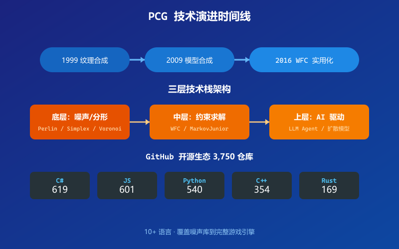
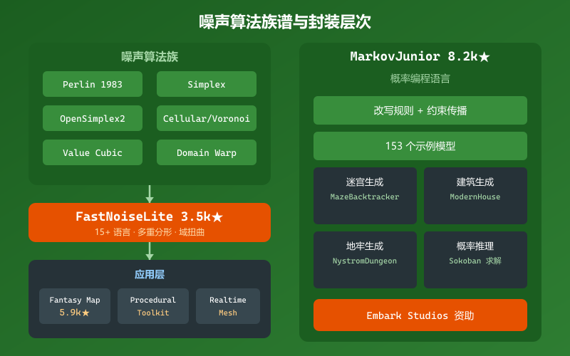
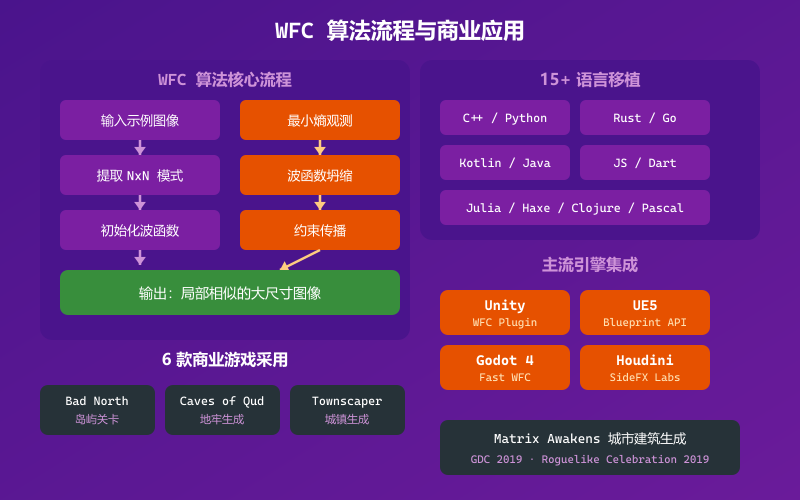
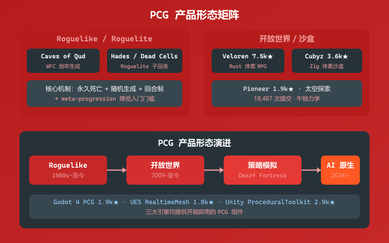
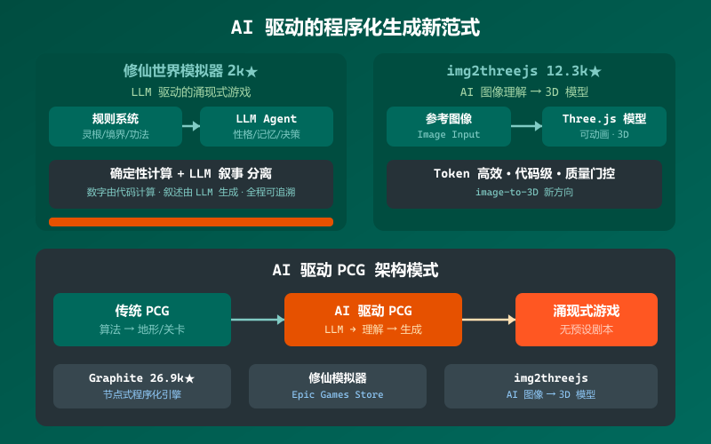

# 洞察：自由生成的游戏——程序化内容生成（PCG）的现状与技术趋势

> 工作包：洞察自由生成的游戏（场景不固化）的现状与技术趋势（意图图谱元素 id 3000）
> 方法：多智能体协作系统研究方法（意图图谱元素 1449）
> 日期：2026-08-20
> 约束：所有洞察结论都必须给出论据来源（URL 链接 + 原文段落）

---

## 第1章：程序化内容生成的总体图景

程序化内容生成（Procedural Content Generation, PCG）已从早期游戏的「随机种子扩展」演变为一门连接算法、约束求解与 AI 的独立学科。GitHub 上以 procedural-generation 为标签的开源仓库已达 3,750 个，覆盖 C#（619）、JavaScript（601）、Python（540）、C++（354）、Rust（169）、GDScript（133）等 10+ 主流语言。

- **洞察结论 1.1**：PCG 在 GitHub 上已形成跨越 10+ 语言的活跃开源生态，3,750 个仓库覆盖从噪声库到完整游戏引擎的各类工具。
  - URL: https://github.com/topics/procedural-generation
  - 原文段落："Here are 3,750 public repositories matching this topic... C# 619, JavaScript 601, Python 540, TypeScript 360, C++ 354, Rust 169, Java 142, GDScript 133, C 95"

- **洞察结论 1.2**：PCG 技术栈从底层的噪声/分形算法，到中层的约束求解与模型合成，再到上层的 AI 生成，形成了三层递进架构——每一层解决的问题不同，但可组合使用。
  - URL: https://github.com/Auburn/FastNoiseLite
  - 原文段落："FastNoise Lite is an extremely portable open source noise generation library with a large selection of noise algorithms. This library focuses on high performance while avoiding platform/language specific features, allowing for easy ports to as many possible languages."

- **洞察结论 1.3**：PCG 的学术研究可追溯至 1999 年 Efros 和 Leung 的纹理合成，2009 年 Merrell 的模型合成奠定了基于示例的生成范式，2016 年后 WFC 算法将这一传统推向实用化——商业游戏大规模采用标志着 PCG 从学术走向产业。
  - URL: https://github.com/mxgmn/WaveFunctionCollapse
  - 原文段落："Alexei A. Efros and Thomas K. Leung, Texture Synthesis by Non-parametric Sampling, 1999. WaveFunctionCollapse is a texture synthesis algorithm... Paul C. Merrell, Model Synthesis, 2009. Merrell derives adjacency constraints between tiles from an example model and generates a new larger model with the AC-3 algorithm."

---

## 第2章：基础算法——噪声、分形与语法生成

程序化生成的最底层是数学函数驱动的随机性——噪声算法。Perlin Noise（1983）是奠基之作，OpenSimplex 解决了其方向性伪影，FastNoiseLite 将这一技术栈封装为跨 15+ 语言的便携库。

- **洞察结论 2.1**：FastNoiseLite（3.5k stars）已成为业界最广泛使用的开源噪声库，覆盖 C#、C++、C、Java、HLSL、GLSL、Rust、Go、JavaScript、Fortran、Zig 等 15+ 种语言，提供 OpenSimplex2、Perlin、Cellular/Voronoi、Value Cubic 等全套噪声算法，以及多重分形选项和域扭曲（domain warp）。
  - URL: https://github.com/Auburn/FastNoiseLite
  - 原文段落："FastNoise Lite is an extremely portable open source noise generation library with a large selection of noise algorithms. Features: 2D & 3D sampling, OpenSimplex2 noise, OpenSimplex2S noise, Cellular (Voronoi) noise, Perlin noise, Value noise, Value Cubic noise, OpenSimplex2-based domain warp, Basic Grid Gradient domain warp, Multiple fractal options for all of the above."

- **洞察结论 2.2**：Fantasy Map Generator（5.9k stars）展示了噪声算法如何从「纯数学」走向「用户可交互的生成工具」——基于 Martin O'Leary 的多边形地图生成和 Amit Patel 的游戏地图生成方法，将地形、气候、文化、城市等层叠为可编辑的 fantasy 世界。
  - URL: https://github.com/Azgaar/Fantasy-Map-Generator
  - 原文段落："Azgaar's Fantasy Map Generator is a free web application that helps fantasy writers, game masters, and cartographers create and edit fantasy maps. Inspiration: Martin O'Leary's Generating fantasy maps, Amit Patel's Polygonal Map Generation for Games."

- **洞察结论 2.3**：MarkovJunior（8.2k stars）是一种基于模式匹配和约束传播的概率编程语言，153 个示例证明「基于规则的生成」可以产生从迷宫到建筑再到拼图的丰富结构。其核心思想是将生成问题表述为马尔可夫算法——有序的改写规则列表，通过约束传播实现概率推理。
  - URL: https://github.com/mxgmn/MarkovJunior
  - 原文段落："MarkovJunior is a probabilistic programming language where programs are combinations of rewrite rules and inference is performed via constraint propagation. Probabilistic inference in MarkovJunior allows to impose constraints on the future state, and generate only those runs that lead to the constrained future."

- **洞察结论 2.4**：ProceduralToolkit（2.9k stars）为 Unity 生态提供了完整的 PCG 工具集，RealtimeMeshComponent（1.8k stars）为 Unreal Engine 5 提供了运行时网格渲染——证明 PCG 已从学术研究走向主流游戏引擎的「开箱即用」组件。
  - URL: https://github.com/Syomus/ProceduralToolkit
  - 原文段落："Procedural generation library for Unity"

---

## 第3章：约束求解——WFC 与 MarkovJunior

如果说噪声算法是「自底向上」的生成，那么约束求解则是「自顶向下」——给定一个示例，生成一个在局部上看起来像示例的更大世界。

- **洞察结论 3.1**：WFC（25.3k stars）算法的核心思想是将纹理合成问题转化为约束满足问题（CSP），使用「最小熵启发式」选择下一个要确定的区域，通过约束传播确保输出只包含输入中存在的 N×N 模式。这一问题在理论上是 NP-hard，但实践中很少遇到矛盾。
  - URL: https://github.com/mxgmn/WaveFunctionCollapse
  - 原文段落："WFC initializes output bitmap in a completely unobserved state... On each observation step an NxN region is chosen among the unobserved which has the lowest Shannon entropy. This region's state then collapses into a definite state... The problem of determining whether a certain bitmap allows other nontrivial bitmaps satisfying condition (C1) is NP-hard, so it's impossible to create a fast solution that always finishes. In practice, however, the algorithm runs into contradictions surprisingly rarely."

- **洞察结论 3.2**：WFC 已被至少 6 款商业游戏采用——Bad North 使用 WFC 生成岛屿关卡，Caves of Qud 使用 WFC 多趟生成地牢，Townscaper 将 WFC 与 marching cubes 结合生成城镇，The Matrix Awakens 使用 WFC 生成城市建筑。Brian Bucklew 在 GDC 2019 和 Roguelike Celebration 2019 上详细讲述了 WFC 在 Caves of Qud 中的应用。
  - URL: https://github.com/mxgmn/WaveFunctionCollapse
  - 原文段落："WFC generates levels in Bad North, Caves of Qud, Dead Static Drive, Townscaper, Matrix Awakens, several smaller games and many prototypes."

- **洞察结论 3.3**：WFC 已被移植到 15+ 种编程语言（C++/Python/Kotlin/Rust/Julia/Go/JavaScript 等），并集成到 Unity、Unreal Engine 5、Godot 4、Houdini 等主流引擎中——证明其已成为游戏产业的「标准工具」。
  - URL: https://github.com/mxgmn/WaveFunctionCollapse
  - 原文段落："Wave Function Collapse algorithm has been implemented in C++, Python, Kotlin, Rust, Julia, Go, Haxe, Java, Clojure, Free Pascal, Dart, p5js, JavaScript and adapted to Unity, Unreal Engine 5, Godot 4 and Houdini."

- **洞察结论 3.4**：MarkovJunior 将 WFC 的思想推广为一种通用概率编程语言——它不仅可以生成，还可以用约束传播做概率推理，甚至能求解 Sokoban 推箱子谜题。Embark Studios、Oskar Stålberg、Freehold Games 等已为其提供资金支持。
  - URL: https://github.com/mxgmn/MarkovJunior
  - 原文段落："Probabilistic inference in MarkovJunior allows to impose constraints on the future state, and generate only those runs that lead to the constrained future. Inference for the Sokoban ruleset solves Sokoban puzzles or even multiagent Sokoban puzzles! MarkovJunior development was funded by Embark Studios, Oskar Stålberg, Freehold Games, Bob Burrough."

---

## 第4章：产品形态——从 Roguelike 到开放世界

程序化生成的游戏已被验证为多种成功的产品形态：Roguelike 地牢探索、开放世界沙盒、策略模拟、AI 原生生成。开源社区也在复制这些产品形态。

- **洞察结论 4.1**：Roguelike 是 PCG 商业化最成功的产品形态，其核心机制——「永久死亡 + 随机生成 + 回合制」——已衍生出「Roguelite」子品类，将随机生成与 meta-progression 结合。Caves of Qud 在 GDC 2019 和 Roguelike Celebration 2019 上详细展示了 WFC 与 constructive procgen 的结合方法。
  - URL: https://github.com/mxgmn/WaveFunctionCollapse
  - 原文段落："At the Game Developers Conference 2019 and the Roguelike Celebration 2019, Brian Bucklew gave talks about WFC and how Freehold Games uses it to generate levels in Caves of Qud. The talks discuss problems with overfitting and homogeny, level connectedness and combining WFC with constructive procgen methods."

- **洞察结论 4.2**：Veloren（7.5k stars）是一个以 Rust 编写的开源体素 RPG，受 Dwarf Fortress 和 Cube World 启发，18,487 次提交，证明 PCG 可以支撑「类 Cube World / Dwarf Fortress」规模的开放世界。
  - URL: https://github.com/veloren/veloren
  - 原文段落："Veloren is an action-adventure RPG game set in a vast fantasy world. It is inspired by other games such as Cube World, The Legend of Zelda: Breath of the Wild, Dwarf Fortress and Minecraft."

- **洞察结论 4.3**：Cubyz（3.6k stars）是以 Zig 编写的体素沙盒游戏，Pioneer（1.9k stars）是以 C++ 编写的太空探索游戏——两者分别证明了 PCG 可以支撑从「体素世界」到「无限宇宙」的完整产品。
  - URL: https://github.com/PixelGuys/Cubyz
  - 原文段落："Voxel sandbox game with a large render distance, procedurally generated content and some cool graphical effects."

- **洞察结论 4.4**：Godot 引擎已成为 PCG 实验的「首选平台」，gdquest-demos 的 godot-4-procedural-generation（1.9k stars）提供了 GDScript 编写的完整 PCG 算法集合，降低了进入门槛。
  - URL: https://github.com/gdquest-demos/godot-4-procedural-generation
  - 原文段落："Procedural generation algorithms and demos for the Godot game engine"

---

## 第5章：AI 驱动新范式——LLM 重塑程序化生成

2024-2026 年，大语言模型（LLM）的兴起正在将 PCG 从「算法生成」推向「AI 理解生成」——游戏不再只是「随机生成地形」，而是「理解游戏叙事并生成与之匹配的内容」。

- **洞察结论 5.1**：修仙世界模拟器（2k stars，已上架 Epic Games Store）标志着「LLM 驱动的涌现式游戏」成为一种新品类——每个 NPC 都是独立的 LLM agent，世界由规则系统 + AI 共同驱动，没有预设剧本，所有剧情由因果逻辑自主推演。其核心亮点包括「全员 AI 驱动」「规则作为基石」「涌现式剧情」。
  - URL: https://github.com/4thfever/cultivation-world-simulator
  - 原文段落："模拟器中，每一个修士都是独立的Agent，可以自由观测环境并做出决策。同时，为了避免AI的幻觉与过度发散，编入了复杂灵活的修仙世界观与运行规则。在规则与 AI 共同编织的世界中，修士Agent们与宗门意志相互博弈又合作，新的精彩剧情不断涌现。"

- **洞察结论 5.2**：LLM 驱动的 PCG 遵循「确定性计算 + LLM 叙事」分离的设计原则——数字由代码计算，叙述由 LLM 生成，全程可追溯。这一原则与金融 Agent 的设计范式高度一致，代表了一种可复用的架构模式。
  - URL: https://github.com/4thfever/cultivation-world-simulator
  - 原文段落："全员 AI 驱动：每个 NPC 都独立基于LLM驱动，都有独立的性格、记忆、人际关系和行为逻辑。他们会根据即时局势做出决策，会有爱恨情仇，会结党营私，甚至会逆天改命。"

- **洞察结论 5.3**：img2threejs（12.3k stars）展示了 AI 生成 3D 模型的新方向——从参考图像重建为代码级、过程化、可动画的 Three.js 模型，将「程序化生成」与「AI 图像理解」结合，是 token 高效的 image-to-3D 方案。
  - URL: https://github.com/img2threejs/img2threejs
  - 原文段落："Rebuild the object in a reference image as a code-only, procedural, quality-gated, animation-ready Three.js model. Token-efficient image-to-3D."

- **洞察结论 5.4**：Graphite（26.9k stars，Rust）代表了「节点式程序化生成」的前沿——不是生成游戏，而是将程序化生成本身做成了生产力工具，用节点图引擎驱动 2D 内容创作，社区共建。
  - URL: https://github.com/GraphiteEditor/Graphite
  - 原文段落："Community-built comprehensive 2D content creation application for graphic design, digital art, and interactive real-time motion graphics powered by a node-based procedural graphics engine"

---

## 总览架构图

