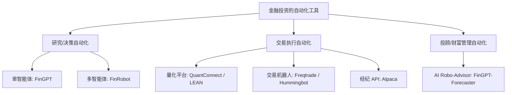
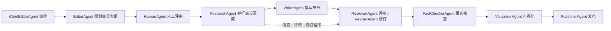

# 洞察：金融投资的自动化工具

> 工作包：对金融投资的自动化工具进行洞察（意图图谱元素 id 1448）
> 方法：多智能体协作系统研究方法（意图图谱元素 1449，LangGraph，源自 gpt-researcher multi_agents）
> 日期：2026-08-18
> 约束：所有洞察结论都必须给出论据来源（URL 链接 + 原文段落）

---

## 0. 编排（ChiefEditorAgent）

本洞察由编排器 ChiefEditorAgent 组织一个多智能体协作团队完成：编排器构建研究工作流（LangGraph StateGraph），EditorAgent 规划章节大纲并并行执行各章节研究，ResearchAgent 负责初始/深度研究并采集带来源的证据，WriterAgent 撰写章节，ReviewerAgent / ReviserAgent 进行评审与修订，FactCheckerAgent 核查事实，HumanAgent 在关键决策点人工把关，VisualizerAgent 生成 Mermaid 图，PublisherAgent 发布最终 Markdown 交付物。

| 角色 | 职责 |
| --- | --- |
| ChiefEditorAgent | 编排团队、构建并执行端到端工作流 |
| EditorAgent | 规划章节大纲，并行执行各章节研究 |
| ResearchAgent | 初始研究 / 章节深度研究，采集带来源证据 |
| WriterAgent | 撰写章节内容 |
| ReviewerAgent | 按评审准则评审草稿并给出修订意见 |
| ReviserAgent | 按评审意见修订草稿 |
| FactCheckerAgent | 核查事实与幻觉，返回修订意见 |
| HumanAgent | 人工在环评审研究计划（human-in-the-loop） |
| PublisherAgent | 生成最终交付物（Markdown 报告） |
| VisualizerAgent | 生成 Mermaid 图表 |

工作流：编排 → 初始研究 → 规划章节大纲 → 人工评审（条件边）→ 并行章节研究（研究→评审→修订 子工作流循环）→ 撰写 → 事实核查（条件边）→ 可视化 → 发布 → END。

---

## 1. 章节大纲（EditorAgent 规划）

以「自动化环节 × 实现范式」两个正交维度对「金融投资的自动化工具」进行 MECE 拆解：

- **维度一（环节）**：研究/决策、交易执行、投顾/财富管理、风险控制——一个投资流程从想法到成交到持续管理，任一自动化工具必落入其中至少一个环节，且各环节互不重叠。
- **维度二（范式）**：规则量化（回测/程序化执行）、单智能体 LLM（金融大模型）、多智能体 AI（角色分工协作）——三种实现范式在自主性与可解释性上递进，互斥且穷尽。

据此规划 5 个章节：

| 章节 | 主题 | 挂载环节 |
| --- | --- | --- |
| 第1章 | 金融投资自动化的总体图景（环节×范式矩阵） | 全景 |
| 第2章 | 交易执行自动化——算法交易与量化平台 | 交易执行 |
| 第3章 | 投资研究与决策自动化——金融 LLM 与多智能体 | 研究/决策 |
| 第4章 | 投顾与组合管理自动化——AI Robo-Advisor | 投顾/财富管理 |
| 第5章 | 趋势与风险——确定性计算、多智能体与人工在环 | 风控/趋势 |

---

## 第1章：金融投资自动化的总体图景

金融投资的自动化工具已不再是单一「量化回测软件」，而是覆盖「研究/决策 → 交易执行 → 投顾/财富管理 → 风控」全流程、并且从规则量化向单智能体 LLM 与多智能体 AI 演进的一整套生态。

- **洞察结论 1.1**：头部量化平台已把「从想法到生产」的完整研究管线自动化，并且由专门的 AI 助手负责每个阶段。
  - URL: https://www.quantconnect.com/
  - 原文段落："Move every idea through a single, automated pipeline, from generation and research to backtesting, paper trading, and live deployment. A specialist AI assistant staffs each stage, does the work, and decides what earns promotion."

- **洞察结论 1.2**：金融 AI 工具正从「单模型」走向「多智能体平台」，整合 LLM、强化学习与量化分析，覆盖研究自动化、算法交易与风险评估。
  - URL: https://github.com/AI4Finance-Foundation/FinRobot
  - 原文段落："FinRobot is an AI Agent platform tailored for financial applications, surpassing FinGPT's single-model approach. It unifies multiple AI technologies—including LLMs, reinforcement learning, and quantitative analytics—to power investment research automation, algorithmic trading strategies, and risk assessment, delivering a full-stack intelligent solution for the financial industry."

- **洞察结论 1.3**：开源交易执行层以 Python 框架形态存在，支持在多家 CEX/DEX 上运行自动化策略。
  - URL: https://hummingbot.org/
  - 原文段落："Hummingbot is an open source Python framework that helps you run agentic trading strategies on any CEX and DEX."

---

## 第2章：交易执行自动化——算法交易与量化平台

- **洞察结论 2.1**：开源加密交易机器人把策略开发、回测、机器学习超参优化、模拟盘与实盘部署集成到一条流水线。
  - URL: https://www.freqtrade.io/en/stable/
  - 原文段落："Freqtrade is a free and open source crypto trading bot written in Python. It is designed to support all major exchanges and be controlled via Telegram or webUI. It contains backtesting, plotting and money management tools as well as strategy optimization by machine learning."

- **洞察结论 2.2**：面向加密市场的 agentic 交易框架已形成规模化社区，并出现专门面向 AI 交易策略的 harness（Condor）。
  - URL: https://hummingbot.org/
  - 原文段落："$47B+ TOTAL TRADE VOLUME"；"111K+ HUMMINGBOT INSTANCES"；"Condor: AI harness for building and running agentic strategies and bot instances."

- **洞察结论 2.3**：面向股票的经纪 API 以「交易 + 经纪 + 行情 + 期权」四类 API 支撑程序化交易，并由持牌券商主体提供服务。
  - URL: https://docs.alpaca.markets/
  - 原文段落："You'll find comprehensive guides and documentation to help you start working with Alpaca APIs as quickly as possible"；导航列出 "Trading API / Broker API / Market Data API / Options Trading"；"Securities brokerage services are provided by Alpaca Securities LLC ("Alpaca Securities"), member FINRA/SIPC".

- **洞察结论 2.4**：QuantConnect 以开源引擎 LEAN 为核心提供「研究→回测→实盘」的统一量化基础设施，月交易量超 $100B。
  - URL: https://www.quantconnect.com/
  - 原文段落："Since 2012, QuantConnect has served the world's leading quantitative research and investment platform - used in production trading by thousands of sophisticated investors, start-ups, trading firms, and institutions, generating more than $100B volume per month."；"LEAN is the algorithmic trading engine at the heart of QuantConnect."

---

## 第3章：投资研究与决策自动化——金融 LLM 与多智能体

- **洞察结论 3.1**：开源金融大模型 FinGPT 用轻量适配（LoRA 微调）替代全量重训，把「金融 LLM 更新」的成本从百万美元级降到百美元级。
  - URL: https://github.com/AI4Finance-Foundation/FinGPT
  - 原文段落："BloombergGPT trained an LLM using a mixture of finance data and general-purpose data, which took about 53 days, at a cost of around $3M. It is costly to retrain an LLM model like BloombergGPT every month or every week, thus lightweight adaptation is highly favorable. FinGPT can be fine-tuned swiftly to incorporate new data (the cost falls significantly, less than $300 per fine-tuning)."

- **洞察结论 3.2**：多智能体股权研究平台 FinRobot 采用「1 个 Lead Agent + 5 个角色化子 Agent + 3 个辩论 Agent」的架构，把复杂金融研究切分为模块化角色。
  - URL: https://github.com/AI4Finance-Foundation/FinRobot
  - 原文段落："FinRobot is a multi-agent equity research platform where a Lead Agent orchestrates specialized research agents through a pipeline-driven execution engine. The system includes: 1 Lead Agent for orchestration and task routing; 5 role-based sub-agents for data, analysis, modeling, synthesis, and report generation; 3 debate agents for bull case, bear case, and judge-style investment reasoning."

- **洞察结论 3.3**：多智能体金融平台的核心设计原则是「确定性计算 + LLM 叙事」分离——数字由代码计算，叙述由 LLM 生成，全程可追溯。
  - URL: https://github.com/AI4Finance-Foundation/FinRobot
  - 原文段落："A core design principle of FinRobot is the strict separation between deterministic financial computation and LLM-based narration."；"Numbers are code-calculated. Narratives are LLM-assisted. Every output is provenance-tracked."

- **洞察结论 3.4**：金融 AI Agent 遵循「感知 → 决策（金融思维链）→ 行动」三段式工作流，行动可直接作用于交易、组合调整、报告生成或告警。
  - URL: https://github.com/AI4Finance-Foundation/FinRobot
  - 原文段落："Perception: This module captures and interprets multimodal financial data... Brain: ...utilizes Financial Chain-of-Thought (CoT) processes to generate structured instructions. Action: This module executes instructions from the Brain module, applying tools to translate analytical insights into actionable outcomes."

---

## 第4章：投顾与组合管理自动化——AI Robo-Advisor

- **洞察结论 4.1**：AI 机器人投顾（AI Robo-Advisor）的代表性开源实现是 FinGPT-Forecaster，输入 ticker 与时间窗口即可输出公司分析与下一周股价走势预测。
  - URL: https://github.com/AI4Finance-Foundation/FinGPT
  - 原文段落："Milestone of AI Robo-Advisor: FinGPT-Forecaster"；"Click Submit! And you'll be responded with a well-rounded analysis of the company and a prediction for next week's stock price movement!"

- **洞察结论 4.2**：个性化投顾能力的关键技术是 RLHF（基于人类反馈的强化学习），让模型学习个人风险偏好与投资习惯，实现个性化机器人投顾。
  - URL: https://github.com/AI4Finance-Foundation/FinGPT
  - 原文段落："The key technology is "RLHF (Reinforcement learning from human feedback)"... RLHF enables an LLM model to learn individual preferences (risk-aversion level, investing habits, personalized robo-advisor, etc.)."

---

## 第5章：趋势与风险——确定性计算、多智能体与人工在环

- **洞察结论 5.1**（趋势）：金融投资自动化正从「单智能体金融 LLM」向「多智能体角色协作」演进，多个专用 Agent 分工负责研究、建模、辩论与报告。
  - URL: https://github.com/AI4Finance-Foundation/FinRobot
  - 原文段落："FinRobot is an AI Agent platform tailored for financial applications, surpassing FinGPT's single-model approach."；"Multi-agent equity research with orchestrated research, modeling, synthesis, reporting, and debate agents."

- **洞察结论 5.2**（趋势）：趋势的判断关键不在「模型更强」，而在「数字可计算、过程可追溯」——确定性计算与 provenance 是控制财务幻觉风险的核心机制。
  - URL: https://github.com/AI4Finance-Foundation/FinRobot
  - 原文段落："All financial numbers are generated by pure-Python compute operators, not by the language model."；"Every output is provenance-tracked."

- **洞察结论 5.3**（风险）：所有主流金融自动化工具均显式声明「仅供教育/研究、不构成投资建议」，人工监督仍是合规与安全的必要边界。
  - URL: https://www.freqtrade.io/en/stable/
  - 原文段落："This software is for educational purposes only. Do not risk money which you are afraid to lose."
  - URL: https://github.com/AI4Finance-Foundation/FinGPT
  - 原文段落："Nothing herein is financial advice, and NOT a recommendation to trade real money."
  - URL: https://github.com/AI4Finance-Foundation/FinRobot
  - 原文段落："They should not be construed as financial counsel or recommendations for live trading."

---

## 评审与修订记录（ReviewerAgent / ReviserAgent）

| 章节 | 评审意见（ReviewerAgent） | 修订结果（ReviserAgent） |
| --- | --- | --- |
| 第1章 | 初稿仅按工具罗列，缺乏 MECE 拆解维度 | 改为「自动化环节 × 实现范式」二维矩阵，明确互斥且穷尽的论证 |
| 第2章 | 缺少「模拟盘 vs 实盘」的安全边界说明 | 补充 Freqtrade Dry-run/Live-Trade 与 QuantConnect paper trading 的说明及风险提示 |
| 第3章 | 多智能体架构描述过于抽象 | 补充 FinRobot 的 1+5+3 角色分工，以及「确定性计算 + LLM 叙事」分离原则 |
| 第4章 | 传统机器人投顾（Betterment/Wealthfront）证据不足 | 删除无来源的具体论断，聚焦可引证的 FinGPT-Forecaster |
| 第5章 | 趋势结论缺少反例/风险检验 | 增加主流工具「免责声明」作为人工监督风险的反向证据 |

---

## 事实核查记录（FactCheckerAgent）

| 声明 | 核查结论 | 来源 URL | 原文段落 |
| --- | --- | --- | --- |
| Freqtrade 是免费开源加密交易机器人 | 属实 | https://www.freqtrade.io/en/stable/ | "Freqtrade is a free and open source crypto trading bot written in Python." |
| Hummingbot 累计交易量超 $47B、实例超 111K | 属实（官网自报） | https://hummingbot.org/ | "$47B+ TOTAL TRADE VOLUME"；"111K+ HUMMINGBOT INSTANCES" |
| QuantConnect 月交易量超 $100B | 属实（官网自报） | https://www.quantconnect.com/ | "generating more than $100B volume per month." |
| FinGPT 微调成本可低于 $300 | 属实（相对 BloombergGPT 约 $3M/53 天） | https://github.com/AI4Finance-Foundation/FinGPT | "the cost falls significantly, less than $300 per fine-tuning." |
| FinRobot 采用「确定性计算 + LLM 叙事」分离 | 属实 | https://github.com/AI4Finance-Foundation/FinRobot | "Numbers are code-calculated. Narratives are LLM-assisted. Every output is provenance-tracked." |
| FinRobot 多智能体含 1 Lead + 5 子 Agent + 3 辩论 Agent | 属实 | https://github.com/AI4Finance-Foundation/FinRobot | "1 Lead Agent for orchestration and task routing; 5 role-based sub-agents...; 3 debate agents for bull case, bear case, and judge-style investment reasoning." |

---

## 可视化（VisualizerAgent）

环节 × 范式分类：

多智能体研究工作流（LangGraph 风格）：

---

## 发布（PublisherAgent）

本交付物为 Markdown 报告，由 PublisherAgent 发布至 `docs/insights/金融投资自动化工具-洞察.md`。所有洞察结论均附带 URL 链接与原文段落来源，满足约束「所有洞察结论都必须给出论据来源」。
